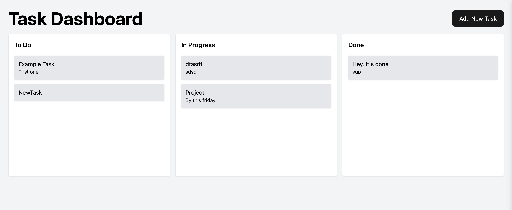

# 🧩 Kanban Task Management Dashboard

A clean and responsive **Kanban-style Task Manager** built using **React.js**. It allows you to create, move, and manage tasks across three columns: **To Do**, **In Progress**, and **Done**. Powered by a mock API for real-time task updates.

---

## ✨ Features

- 🧱 Drag & drop tasks across columns
- ➕ Add new tasks via a modal form
- ⚡ Optimistic UI for instant feedback
- ☁️ Mock API integration (using [MockAPI](https://mockapi.io))
- 🎯 Clean UI using Tailwind CSS

---

## 🚀 Getting Started

### Prerequisites

- Node.js (v16+ recommended)
- npm or yarn

### 1. Clone the Repository

```bash
git clone https://github.com/your-username/kanban-dashboard.git
cd kanban-dashboard
```

## Install Dependencies

```bash
npm install
# or
yarn install
```

## Run the App

```bash
npm run dev
# or
yarn dev
```

##Project Structure

```less
.
├── components/
│   ├── Column.jsx         // Renders tasks for each column
│   └── TaskForm.jsx       // Form modal to create tasks
├── App.jsx                // Main dashboard logic                 // Centralized API methods
├── main.jsx               // React entry point
├── index.css              // Tailwind styles
└── ...
```

## 📸 Preview


